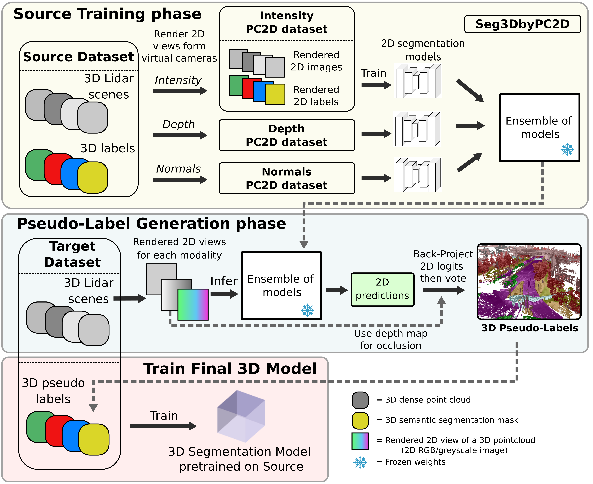

# Multi-View Projection for Unsupervised Domain Adaptation in 3D Semantic Segmentation

Official repository of the method **Seg3DbyPC2D** and **Seg3Dby2D**. More details can be found in the paper:

**Multi-View Projection for Unsupervised Domain Adaptation in 3D Semantic Segmentation**, ICPR 2026 [[arXiv](https://arxiv.org/abs/2505.15545v3)]
by *Andrew Caunes, Thierry Chateau, Vincent Fremont*

**Accepted to ICPR 2026! 🎉🥳**

<p align="center">
  
</p>

<p align="center">
  <em>
    Seg3DbyPC2D. Source scenes are rendered into PC2D datasets that train 2D models directly in
    rendered-view domain. These models are then applied to rendered target views;
    the resulting predictions are projected back in 3D, fused into pseudo-labels,
    and used to fine-tune a source-pretrained 3D backbone.
  </em>
</p>

## Code Availability

The full training code is not made available for now for intellectual property reasons.
In this public repository, for reproducibility, we provide:

- exact class mappings;
- data preparation utilities;
- visualization utilities;
- metrics computation details.

## Metrics

All final experiment results are evaluated with the 3D semantic segmentation metrics from the [MMDetection3D framework](https://github.com/open-mmlab/mmdetection3d), in particular its [SemanticKITTI dataset and evaluation support](https://mmdetection3d.readthedocs.io/en/latest/advanced_guides/datasets/semantickitti.html). This computes per-class IoU and mean IoU from the confusion matrix.

For SemanticKITTI, this corresponds exactly to the [official SemanticKITTI evaluation](https://github.com/PRBonn/semantic-kitti-api) metrics; we checked this thoroughly against the official evaluator.

The official [nuScenes lidarseg evaluation](https://github.com/nutonomy/nuscenes-devkit/tree/master/python-sdk/nuscenes/eval/lidarseg) differs very slightly: unlike the SemanticKITTI/MMDetection3D convention used here, predicting the ignore class on a point with a valid ground-truth label does not incur a penalty.

## Class Mappings

[seg_3D_by_2D/core/classes_dicts.py](./seg_3D_by_2D/core/classes_dicts.py) defines the class taxonomies used in the experiments and the conversion rules between them.

The file is organized around a common intermediate taxonomy named `global_ext`. A conversion from a source class system to a target class system is done in two steps:

1. map each source class to `global_ext` with the source system `to_global_dict`;
2. map each `global_ext` class to the target system with the target system `from_global_dict`.

This makes it possible to compare, train, or evaluate datasets whose native labels do not use the same semantic categories.

### Main Taxonomy Families

`classes_dicts.py` contains two kinds of class systems.

Dataset-oriented class systems keep the source dataset naming or indices, but define how those labels should be interpreted for a target taxonomy:

- `nuscenes_uda`, `nuscenes_dglss`, `nuscenes_sk19`, `nuscenes_ns16`, `nuscenes_static`;
- `semantickitti_uda`, `semantickitti_dglss`, `semantickitti_sk19`, `semantickitti_ns16`, `semantickitti_static`;
- `synlidar`, `synlidar_dglss`, `synlidar_sk19`;
- `waymo`;
- older Mapillary systems: `mapillary_nbs`, `mapillary_ext`.

Prediction or evaluation class systems define the target label spaces:

- `uda`: 12-class UDA label space with `background`, vehicles, `person`, drivable area, sidewalk, terrain, vegetation, and `manmade`;
- `dglss`: 11-class DGLSS label space with no `manmade` class; manmade objects are mapped to `background`;
- `sk19`: SemanticKITTI 19-class benchmark label space plus `background`;
- `ns16`: nuScenes 16-class benchmark label space plus `background`;
- `static`: static-scene classes only;
- `rare`: a small label space for rare-class experiments;
- `global_ext`: the broad intermediate taxonomy used internally for conversions.

**Important naming note: in the thesis manuscript, the taxonomy called **`uda`** corresponds to the **`dglss`** class system in this file. Use `dglss` in this repository when you want to reproduce that manuscript taxonomy.**

### Display a Mapping

To print the mapping between a dataset class system and a target class system, run the module with `--cs1` and `--cs2`.

For example, to inspect how nuScenes source labels are mapped to the repository `uda` target classes:

```bash
python -m seg_3D_by_2D.core.classes_dicts --cs1 nuscenes_uda --cs2 uda
```

For the thesis-manuscript UDA taxonomy, use `dglss`:

```bash
python -m seg_3D_by_2D.core.classes_dicts --cs1 nuscenes_dglss --cs2 dglss
```

The output lists:

- classes present in both systems;
- classes present only in one system;
- string-to-string mappings, for example `vehicle.car --> car`;
- integer-index mappings, for example nuScenes label ids to target label ids.

You can also use the converter programmatically:

```python
import numpy as np

from seg_3D_by_2D.core.classes_dicts import (
    classes_systems_converter,
    nuscenes_uda_classes_system,
    uda_classes_system,
)

converter = classes_systems_converter(
    nuscenes_uda_classes_system,
    uda_classes_system,
)

print(converter.cs1_to_cs2_dict)
print(converter.cs1_to_cs2_ind_dict)

nuscenes_label_ids = np.array([17, 24, 28])  # vehicle.car, flat.driveable_surface, static.manmade
uda_label_ids = np.vectorize(converter.cs1_to_cs2_ind_dict.get)(nuscenes_label_ids)
print(uda_label_ids)
```

## Data Preparation

The preparation scripts are in [seg_3D_by_2D/datasets](./seg_3D_by_2D/datasets). They convert raw driving datasets into scene folders used by the projection and evaluation pipeline.

Each prepared scene typically contains:

- `registered_pointcloud.las`: all selected LiDAR scans registered in a common frame;
- `timestamps_infos.npz`: for each original point, a synthetic timestamp, a flag telling whether the point was kept after cropping, and the original scan/file index;
- `lidar_poses.npy`: LiDAR poses relative to the reference scan;
- `point_segmasks_gt.npy`: point labels, when `save_gt=True`;
- `sensor_positions.npz`: per-point sensor positions, when `save_sensor_positions=True`;
- `depth_maps/`: optional rendered depth maps used when camera colorization is enabled.

The scripts can crop points near the ego vehicle or outside a 3D box, concatenate several scans into one scene, normalize or blur intensity, save ground-truth labels, recompute only ground truth, and optionally colorize registered point clouds from cameras when the dataset has images and calibration.

### Expected `data/` Layout

Raw datasets are not included. Place them under `data/` or create symlinks to your local copies:

```text
data/
  nuscenes/
    v1.0-trainval/
    samples/
    sweeps/
    lidarseg/
  semantickitti/
    dataset/
      sequences/
        00/
          velodyne/
          labels/
          calib.txt
          poses.txt
          image_2/
          image_3/
  synlidar/
    sequences/
      00/
        velodyne/
        labels/
        poses.txt
```

Prepared outputs can be written anywhere, but this README uses:

```text
data/prepared/
  nuscenes/
  semantickitti/
  synlidar/
```

### nuScenes

[prepare_nuscenes.py](./seg_3D_by_2D/datasets/nuscenes/prepare_nuscenes.py) prepares complete nuScenes scenes. It looks up scenes by name through the nuScenes metadata, registers all LiDAR sweeps of the scene, optionally saves lidarseg ground truth for key frames, and can colorize the registered cloud using the six nuScenes cameras.

Example: prepare one scene without camera colorization:

```bash
mkdir -p data/prepared/nuscenes/scene-0001

python - <<'PY'
from nuscenes import NuScenes
from seg_3D_by_2D.datasets.nuscenes.prepare_nuscenes import prepare_nuscenes

nuscenes_path = "data/nuscenes"
nusc = NuScenes(version="v1.0-trainval", dataroot=nuscenes_path, verbose=True)

prepare_nuscenes(
    roots=["data/prepared/nuscenes/scene-0001"],
    nusc=nusc,
    nuscenes_path=nuscenes_path,
    exp_name="default",
    save_gt=True,
    save_sensor_positions=True,
    colorize_with_cameras=False,
)
PY
```

The output files will be written to `data/prepared/nuscenes/scene-0001/default/`.

To use camera colors, set `colorize_with_cameras=True`. The default camera list is `CAM_FRONT`, `CAM_FRONT_LEFT`, `CAM_FRONT_RIGHT`, `CAM_BACK`, `CAM_BACK_LEFT`, and `CAM_BACK_RIGHT`.

### SemanticKITTI

[prepare_semantickitti.py](./seg_3D_by_2D/datasets/semantickitti/prepare_semantickitti.py) prepares a frame interval from one SemanticKITTI sequence. The scene name must encode the sequence and frame range as:

```text
<sequence>_<start_frame>_<end_frame>
```

For example, `00_000000_000099` means sequence `00`, frames 0 to 99.

Example: prepare frames 0 to 99 from sequence 00:

```bash
python - <<'PY'
from seg_3D_by_2D.datasets.semantickitti.prepare_semantickitti import prepare_semantickitti

prepare_semantickitti(
    roots_to_dataset={
        "data/prepared/semantickitti/00_000000_000099": "data/semantickitti/dataset/sequences/00",
    },
    output_folder="data/prepared/semantickitti",
    exp_name="default",
    save_gt=True,
    save_sensor_positions=True,
    colorize_with_cameras=False,
)
PY
```

The output files will be written to `data/prepared/semantickitti/00_000000_000099/default/`.

Useful options include:

- `extend_scenes_with_scans`: add scans before and after the interval to reduce sparse borders;
- `freq_extended`: sampling frequency for the added scans;
- `gt_from_pred=True`: read labels from `predictions/` instead of `labels/`;
- `recompute_gt_only=True`: rebuild `point_segmasks_gt.npy` without rewriting the registered cloud;
- `colorize_with_cameras=True`: project the registered cloud into KITTI cameras and save RGB colors, using `image_2` and `image_3` by default.

### SynLiDAR

[prepare_synlidar.py](./seg_3D_by_2D/datasets/synlidar/prepare_synlidar.py) follows the same scene-interval idea as SemanticKITTI. It expects each sequence to contain `velodyne/`, `labels/`, and `poses.txt`. It registers the selected scans, saves labels, can use predictions as labels for debugging, and supports scene extension.

Example: prepare frames 0 to 99 from sequence 00:

```bash
python - <<'PY'
from seg_3D_by_2D.datasets.synlidar.prepare_synlidar import prepare_synlidar

prepare_synlidar(
    roots_to_dataset={
        "data/prepared/synlidar/00_000000_000099": "data/synlidar/sequences/00",
    },
    output_folder="data/prepared/synlidar",
    exp_name="default",
    save_gt=True,
    save_sensor_positions=True,
)
PY
```

The output files will be written to `data/prepared/synlidar/00_000000_000099/default/`.

Useful options include:

- `extend_scenes_with_scans` and `freq_extended` for denser scene borders;
- `gt_from_pred=True` to read `predictions/` instead of `labels/`;
- `recompute_gt_only=True` to regenerate labels without rewriting the cloud;
- `blur_intensity_k` or `blur_with_random_intensity` to smooth intensity values.

## Citation

If you use this repository, please cite the Seg3DbyPC2D paper. The proceedings citation will be updated when available.

```bibtex
@misc{caunes2026seg3dbypc2d,
      title={Multi-View Projection for Unsupervised Domain Adaptation in 3D Semantic Segmentation}, 
      author={Andrew Caunes and Thierry Chateau and Vincent Fremont},
      year={2026},
      eprint={2505.15545},
      archivePrefix={arXiv},
      primaryClass={cs.CV},
      url={https://arxiv.org/abs/2505.15545}, 
}
```

## Acknowledgments

We thank the following projects for their code and resources:

- [MMDetection3D](https://github.com/open-mmlab/mmdetection3d) for training, experiment and evaluation infrastructure.
- [Pyrender](https://github.com/mmatl/pyrender) for 3D rendering.
- [NKSR](https://github.com/nv-tlabs/NKSR) for mesh rendering and normal estimation.

This project was provided with computing AI and storage resources by GENCI at IDRIS thanks to the grant `2026-AD011012128R5` on the Jean Zay H100 partition.
